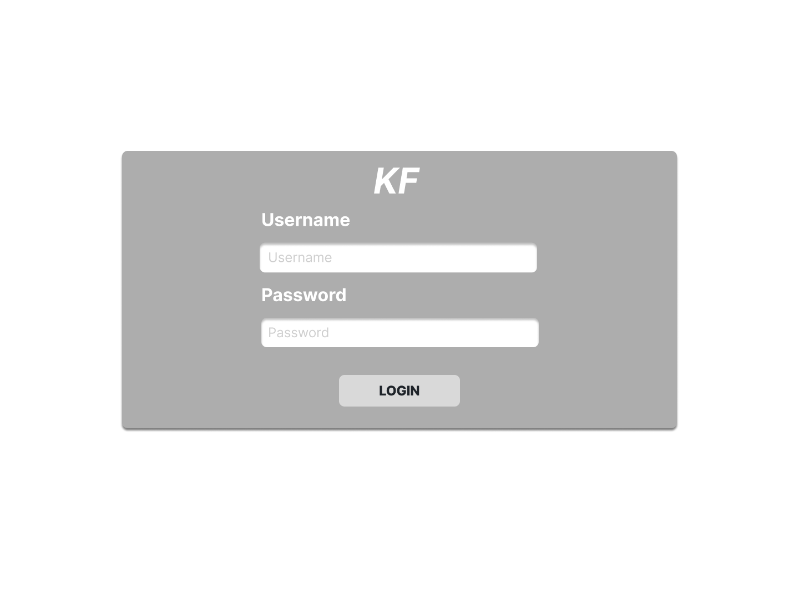
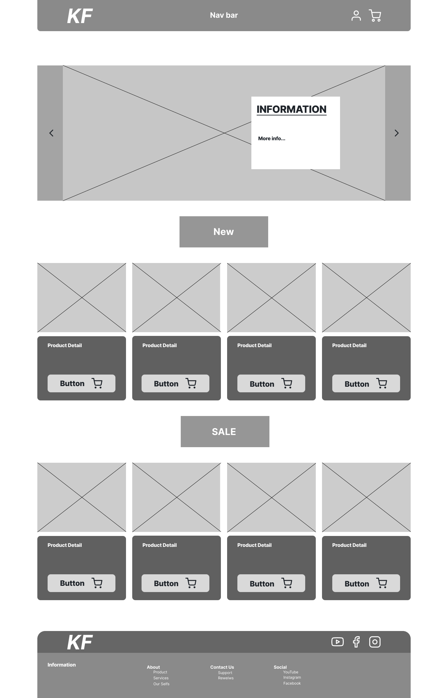
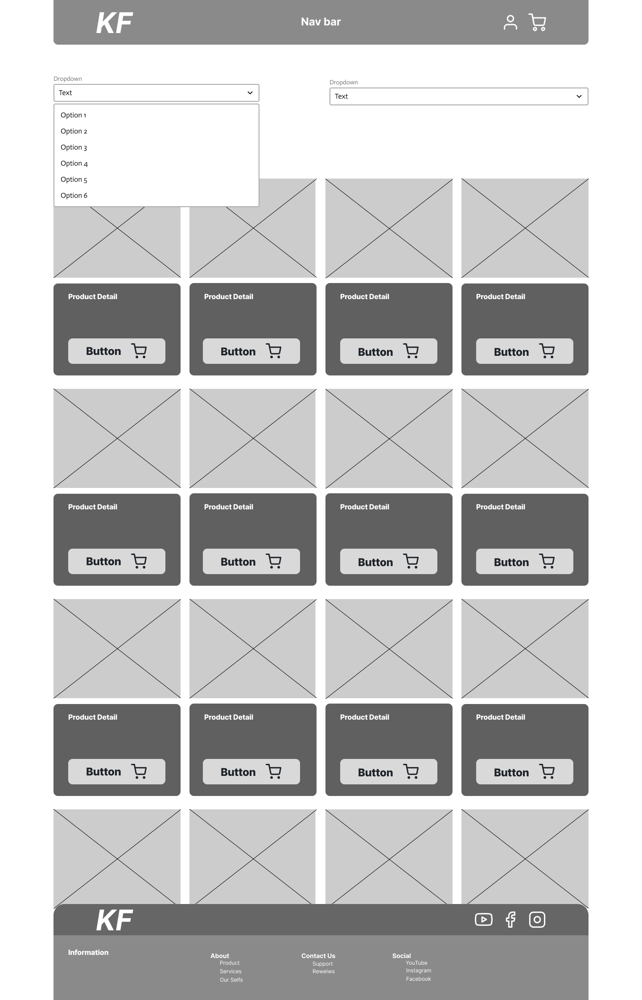
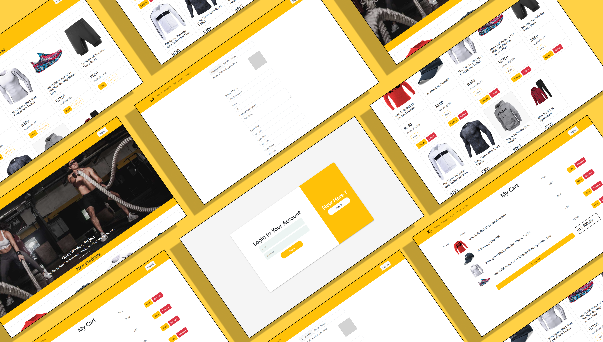
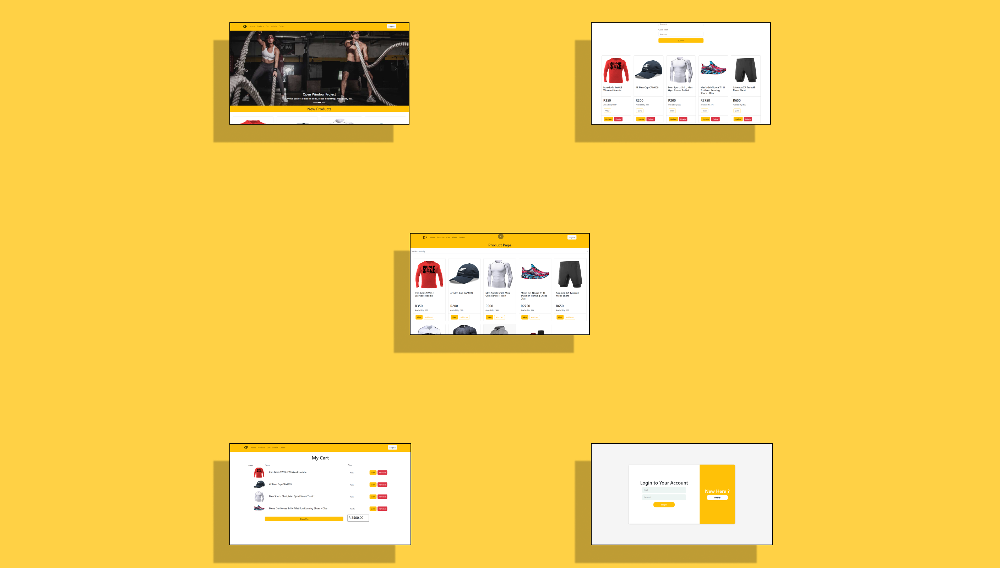
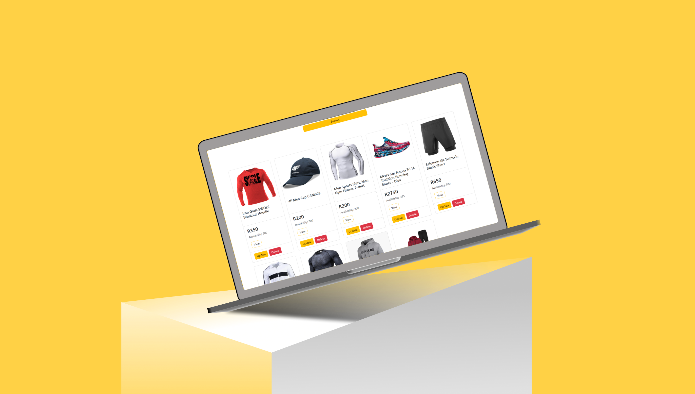

Krahtz Fitness
DV200_Project
 
## About The Project
### Description

 
In this term we used React again but I do have a better understanding of how to use it. I also worked with SQL in the past but for this term I was more focused on the other technologies of MERN stack (Node.js, Express.js, MongoDB Atlas). I used these technologies to sxplore these skills in creatin a Ecommerce web application.

## Features And Functionality

 On the index page you won't be able to go to a different page without logging in first. in order to see the other pages you will need to log in with the correct information otherwise you will be given an error that tells you what information field is wrong or missing. When the detail of the user is correct they will be redirected to the home page where the user will be welcomed with a carousel and items that is on-sale.

 On the admin page the admin will be able to add, remove, and update products if need be. When the admin update an item they will be prompt with a model form that allow them to change information, however the image won't be able to be updated.

On the other pages the information is displayed in card format (product, landing, and admin page) with the help of mongodb where all our product information is stored. I am using axios and routes to incorporate the CRUD functionality to my application

When a user want to checkout they are required to be logged in and if they want to add an item to the database they require admin access. After theuser is done with their session they can simply click on the logout button and will be redirected to the login page.

## Concept Process
<h3>Wireframes</h3>

## Development Process
### Implementation Process

For the project I stated off with designing wireframes and getting an idea of how I would like my application to look like. I used figma to create the wireframes and any other idea I have regarding designing the application. I then created my react app with all the dependencies required for setting up the front end and back end of the application.

I create the routes for our server side to access our database and to be able to do the CRUD functionality we require for the application. When the routes for our CRUD functionality was implemented I started off with the admin page to be able to Create, Read, Update, and Delete products from the application and database. After the admin was complete I made it sothat the cards/products are being read on the rest of the application.

Now that I was able to read the products on the main pages I made it so that when a product is being viewed the ID of the product is send through to the single product page and used to access the product id in outr database so that we display the correct information for each product.

 Adding the CRUD functionality was not to big of an issue but had my struggles. Creating the cart and order page I found more difficult. I was able to add the product to the cart but was not able to change the amount per item and update the stock level of our products in te database when an order has been dispached.

<h3>Highlights</h3>
<ol>
 <li>
  The biggest milestone in the project for me was having the images dispaly on the application and not only on a single page and having information stored and update in sessionStorage when aitem is added or removed from the cart.
 </li>
 <li>Having functional CRUD functionaity on my admin page and having a model pop up when a product id being updated</li>
 <li>A functional Login page with authentication</li>
</ol>
<h3>Challenges</h3> 
<ol>
 <li>Having the Image store in the correct places (database and localfiles)</li>
 <li>Having the Image display</li>
 <li>Adding multible items to my sessionStorage for the cart.</li>
</ol>

## Future Implementation

Creating the functionality to update the quantity of an item.

## Final Outcome
### Mockups

### Video Demonstration

You can view te demonstration video <a href="https://drive.google.com/file/d/1JF4eZ0-_Qj262azdL5Sy5eT8T0fFMp6N/view?usp=drive_link">here</a>

## Conclution

In this project I have learned a lot wat you can accomplish with the use of MERN and how it can make the work load a lot less even though we had to think a bit more on ways to solve our errors.

