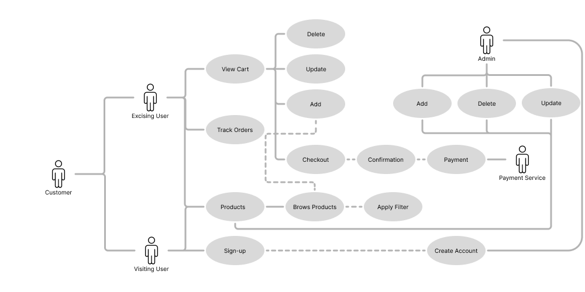

<h1 align="center" style="padding:0;margin:0;">Krahtz Fitness: a web application created using React</h1>
<h3 align="center" style="padding:0;margin:0;">Website</h3>
<h4 align="center">Christian Krahtz</h4>
<h6 align="center">DV200 | Term 4</h6>

## Table of Contents

- [Getting Started](#getting-started-with-create-react-app)
    - [Script](#available-scripts)
    - [Learn More](#learn-more)
- [About The Project](#about-the-project)
    - [Description](#description)
- [Features And Functionality](#features-and-functionality) 
- [Concept Process](#concept-process)
    - [Ideation](#ideation)   
    - [Diagrams](#diagrams)   
    - [Wireframes](#wireframes)
- [Development Process](#development-process)
    - [Implementation Process](#implementation-process)
        - [Highlights](#highlights)
        - [Challenges](#challenges)
    - [Future Implementation](#future-implementation)
- [Final Outcome](#final-outcome)
    - [Mockups](#mockups)
    - [Walkthrough](#walkthrough)
    - [Video Demonstration](#video-demonstration)
- [Conclusion](#conclusion)
- [Acknowledgements](#acknowledgements)

# Getting Started with Create React App

This project was bootstrapped with [Create React App](https://github.com/facebook/create-react-app).

## Available Scripts

In the project directory, you can run:

### `npm start`

Runs the app in the development mode.\
Open [http://localhost:3000](http://localhost:3000) to view it in your browser.

The page will reload when you make changes.\
You may also see any lint errors in the console.

### `npm test`

Launches the test runner in the interactive watch mode.\
See the section about [running tests](https://facebook.github.io/create-react-app/docs/running-tests) for more information.

### `npm run build`

Builds the app for production to the `build` folder.\
It correctly bundles React in production mode and optimizes the build for the best performance.

The build is minified and the filenames include the hashes.\
Your app is ready to be deployed!

See the section about [deployment](https://facebook.github.io/create-react-app/docs/deployment) for more information.

### `npm run eject`

**Note: this is a one-way operation. Once you `eject`, you can't go back!**

If you aren't satisfied with the build tool and configuration choices, you can `eject` at any time. This command will remove the single-build dependency from your project.

Instead, it will copy all the configuration files and the transitive dependencies (webpack, Babel, ESLint, etc) right into your project so you have full control over them. All of the commands except `eject` will still work, but they will point to the copied scripts so you can tweak them. At this point, you're on your own.

You don't have to ever use `eject`. The curated feature set is suitable for small and middle deployments, and you shouldn't feel obligated to use this feature. However, we understand that this tool wouldn't be useful if you couldn't customize it when you are ready for it.

## Learn More

You can learn more in the [Create React App documentation](https://facebook.github.io/create-react-app/docs/getting-started).

To learn React, check out the [React documentation](https://reactjs.org/).

### Code Splitting

This section has moved here: [https://facebook.github.io/create-react-app/docs/code-splitting](https://facebook.github.io/create-react-app/docs/code-splitting)

### Analyzing the Bundle Size

This section has moved here: [https://facebook.github.io/create-react-app/docs/analyzing-the-bundle-size](https://facebook.github.io/create-react-app/docs/analyzing-the-bundle-size)

### Making a Progressive Web App

This section has moved here: [https://facebook.github.io/create-react-app/docs/making-a-progressive-web-app](https://facebook.github.io/create-react-app/docs/making-a-progressive-web-app)

### Advanced Configuration

This section has moved here: [https://facebook.github.io/create-react-app/docs/advanced-configuration](https://facebook.github.io/create-react-app/docs/advanced-configuration)

### Deployment

This section has moved here: [https://facebook.github.io/create-react-app/docs/deployment](https://facebook.github.io/create-react-app/docs/deployment)

### `npm run build` fails to minify

This section has moved here: [https://facebook.github.io/create-react-app/docs/troubleshooting#npm-run-build-fails-to-minify](https://facebook.github.io/create-react-app/docs/troubleshooting#npm-run-build-fails-to-minify)

# About The Project

## Description

In this term, we used React again but I do have a better understanding of how to use it. I also worked with SQL in the past but for this term, I was more focused on the other technologies of the MERN stack (Node.js, Express.js, MongoDB Atlas). I used these technologies to explore these skills in creating an e-commerce web application.

# Features And Functionality

On the index page, you won't be able to go to a different page without logging in first. in order to see the other pages you will need to log in with the correct information otherwise you will be given an error that tells you what information field is wrong or missing. When the detail of the user is correct they will be redirected to the home page where the user will be welcomed with a carousel and items that are on sale.

On the admin page, the admin will be able to add, remove, and update products if need be. When the admin updates an item they will be prompted with a model form that allows them to change information, however, the image won't be able to be updated.

On the other pages, the information is displayed in card format (product, landing, and admin page) with the help of MongoDB where all our product information is stored. I am using Axios and Routes to incorporate the CRUD functionality into my application

When a user wants to checkout they are required to be logged in and if they want to add an item to the database they require admin access. After the user is done with their session they can simply click on the logout button and will be redirected to the login page.
 
# Concept Process

## Ideation

For my inspiration, I looked at e-commerce applications on Pinterest. Click <a href="https://pin.it/4omXJpt">here</a> to view.

## Diagrams

## Wireframes

### Login

### Home

### Product

### Admin

### Single View

# Development Process

## Implementation Process

For the project, I started off with designing wireframes and getting an idea of how I would like my application to look. I used Figma to create the wireframes and any other ideas I had regarding designing the application. I then created my React app with all the dependencies required for setting up the front end and back end of the application.

I create the routes for our server side to access our database and to be able to do the CRUD functionality we require for the application. When the routes for our CRUD functionality were implemented I started off with the admin page to be able to Create, Read, Update, and Delete products from the application and database. After the admin was complete I made it so that the cards/products are being read on the rest of the application.

Now that I was able to read the products on the main pages I made it so that when a product is being viewed the ID of the product is sent through to the single product page and used to access the product ID in our database so that we display the correct information for each product.

Adding the CRUD functionality was not too big of an issue but had my struggles. Creating the cart and order page I found more difficult. I was able to add the product to the cart but was not able to change the amount per item and update the stock level of our products in the database when an order has been dispatched.

### Highlights 

* The biggest milestone in the project for me was having the images displayed on the application and not only on a single page and having information stored and updated in sessionStorage when an item is added or removed from the cart.
* Having functional CRUD functionality on my admin page and having a model pop up when a product ID is being updated
* A functional Login page with authentication

### Challenges

* Having the Image stored in the correct places (database and local files)
* Having the Image display
* Adding multiple items to my sessionStorage for the cart

## Future Implementation

Creating the functionality to update the quantity of an item.

# Final Outcome

## Mockups

## Walkthrough

You can view the walkthrough video <a href="https://drive.google.com/file/d/19pDzSjkgz7bjKIvl36Ca7hd78iugGUhk/view?usp=sharing">here</a>

## Video Demonstration

You can view the demonstration video <a href="https://drive.google.com/file/d/1JF4eZ0-_Qj262azdL5Sy5eT8T0fFMp6N/view?usp=drive_link">here</a>

# Conclusion

In this project, I have learned a lot about what you can accomplish with the use of MERN and how it can make the workload a lot less even though we had to think a bit more about ways to solve our errors.

# Acknowledgements

- [W3Schools](https://www.w3schools.com/)
- [React Bootstrap](https://react-bootstrap.netlify.app/docs/getting-started/introduction/)
- [Stack Overflow](https://stackoverflow.com/)
- [Figma](https://www.figma.com/)
- [ChatGPT](https://chat.openai.com/)
